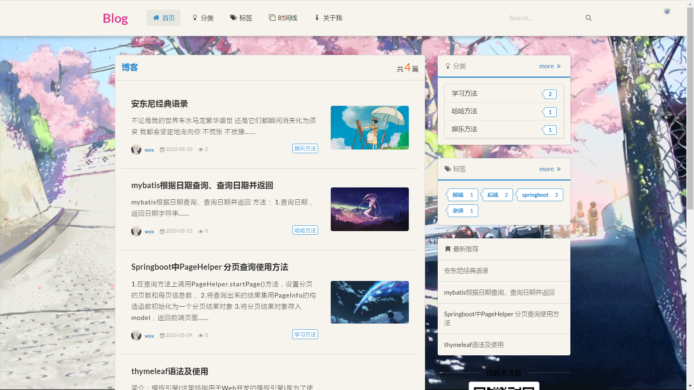
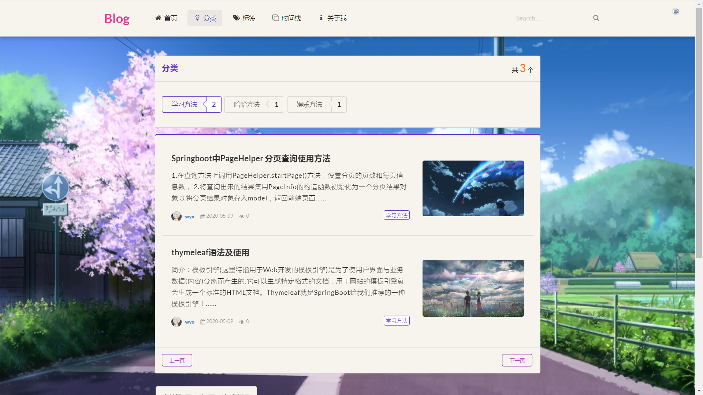
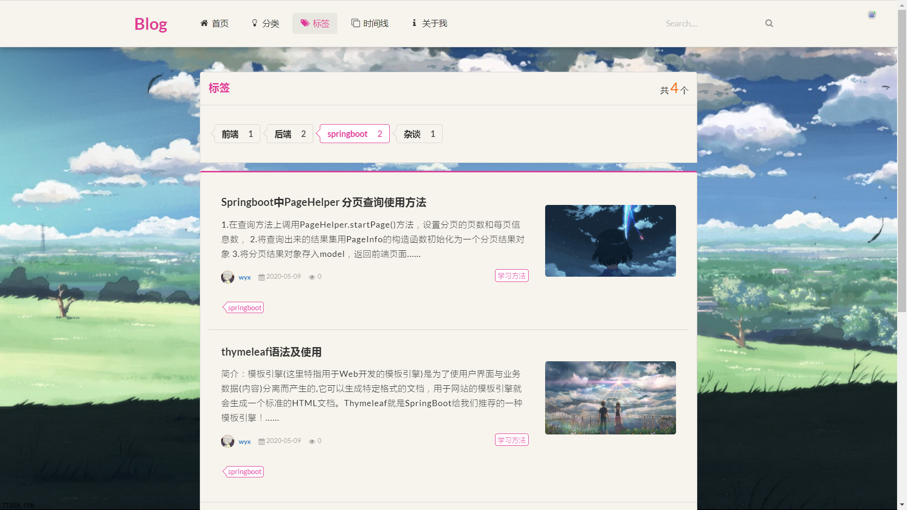
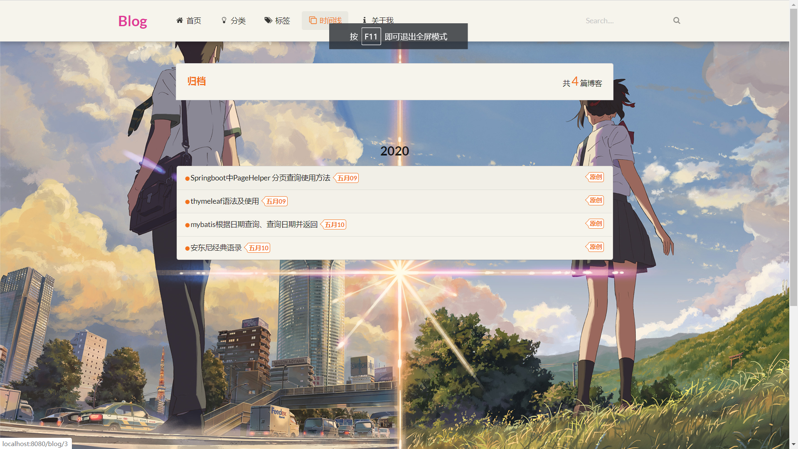
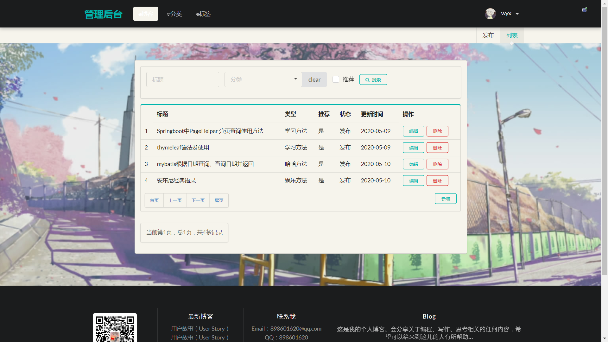
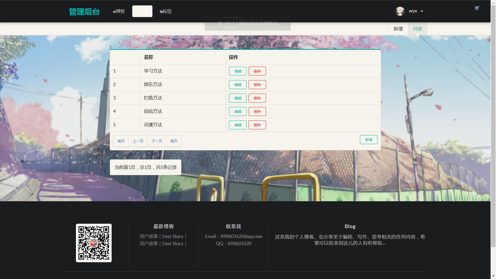

Spring Boot个人博客demo

项目参照b站李仁密老师的Spring Boot开发小而美的个人博客。

**把持久层JPA修改为了mybatis**，前端页面是直接导入的模板

**用到的技术：**

- 后端：Spring Boot + mybatis
- 数据库：MySQL

**工具与环境：**

- IDEA
- Maven 3.6.2
- JDK 8
- springboot 2.2.5

**博客展示界面**

**后台管理界面**

